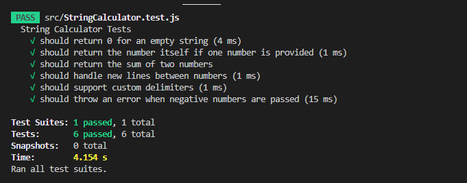
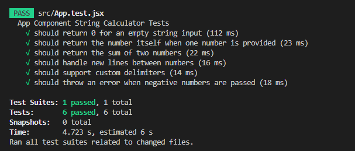

# String Calculator Kata - TDD with React

This is a simple String Calculator implemented in **React**, following the principles of **Test-Driven Development (TDD)**. Calculator supports comma-separated numbers, new lines as delimiters, and custom delimiters, and throws errors for negative numbers.


## Public URL. 
https://string-calculator-kata-sepia.vercel.app/


## Features

- Add numbers from a string input.
- Support for commas and new lines as delimiters.
- Custom delimiters support (e.g., `//;\n1;2`).
- Error handling for negative numbers (throws an error and shows all negative numbers).
- Test-Driven Development (TDD) approach with comprehensive test coverage.

## Project Setup

 **Clone the repository**:

   ```bash git clone https://github.com/jayeshsojitra103/string-calculator-kata```
   
   ```cd string-calculator-kata```

### Installation
   ```npm install```

## Running Tests
```npm test```

Function Testcase


App.ts Testcase

